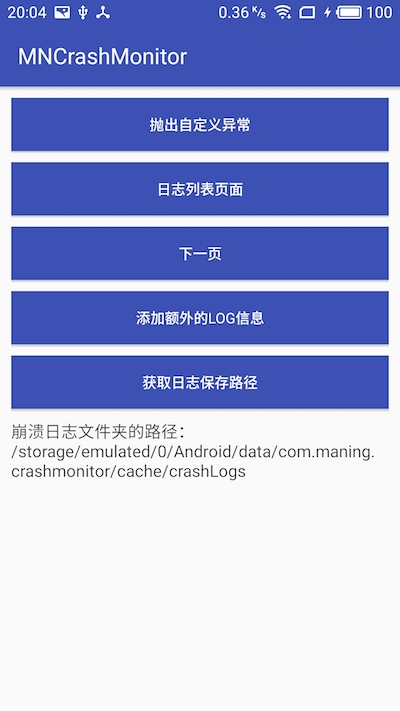
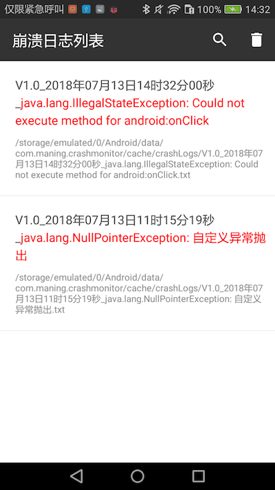
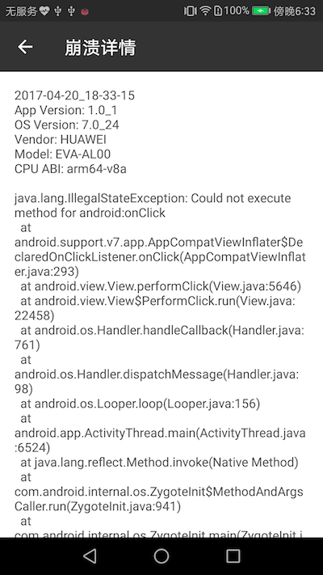

# MNCrashMonitor
MNCrashMonitor（支持AndroidX） 监听程序崩溃日志,直接页面展示崩溃日志列表,调试方便,测试人员可以随时给程序猿查看日志详情,可以动态添加日志内容,手机直接查看日志内容可以分享,复制,生成长截图，高亮显示。
[](https://jitpack.io/#maning0303/MNCrashMonitor)

## 截图

<div align="center">




</div>


## 如何添加
   ### Gradle添加：
   #### 1.在Project的build.gradle中添加仓库地址

``` gradle
   	allprojects {
   		repositories {
   			...
   			maven { url "https://jitpack.io" }
   		}
   	}
```

   #### 2.在app目录下的build.gradle中添加依赖
``` gradle
        //AndroidX
        implementation 'androidx.legacy:legacy-support-v4:1.0.0'
        implementation 'androidx.appcompat:appcompat:1.2.0'
        implementation 'androidx.recyclerview:recyclerview:1.1.0'
        implementation 'com.github.maning0303:MNCrashMonitor:V1.2.0'


        //support版本,后期不在更新,请尽快升级到AndroidX,源码请查看support分支
        implementation 'com.android.support:support-v4:26.1.0'
        implementation 'com.android.support:appcompat-v7:26.1.0'
        implementation 'com.android.support:recyclerview-v7:26.1.0'
        implementation 'com.github.maning0303:MNCrashMonitor:V1.1.1'
```

## 使用方法:
### 1.Application 的 onCreate()方法 初始化：

``` java

          /**
           * 初始化日志系统
           * context :    上下文
           * isDebug :    是不是Debug模式,true:崩溃后显示自定义崩溃页面 ;false:关闭应用,不跳转奔溃页面(默认)
           * CrashCallBack : 回调执行
           */
          MCrashMonitor.init(this, true, new MCrashCallBack() {
              @Override
              public void onCrash(File file) {
                  //可以在这里保存标识，下次再次进入把日志发送给服务器
                  Log.i(TAG, "CrashMonitor回调:" + file.getAbsolutePath());
              }
          });

```

### 2.动态设置其它额外信息到日志中（如用户手机号，wifi状态等信息）：

``` java

        String extraInfo = "用户手机号码：16666666666" +
                "\n用户网络环境：wifi";
        MCrashMonitor.setCrashLogExtraInfo(extraInfo);

```

### 3.其它相关方法介绍：

``` java

        /**
         * 主类
         */
        public class MCrashMonitor {

            /**
             * 初始化
             *
             * @param context 上下文
             */
            public static void init(Context context) {
                MCrashHandler crashHandler = MCrashHandler.getInstance();
                crashHandler.init(context);
            }

            /**
             * 初始化
             *
             * @param context 上下文
             * @param isDebug 是否处于debug状态
             */
            public static void init(Context context, boolean isDebug) {
                MCrashHandler crashHandler = MCrashHandler.getInstance();
                crashHandler.init(context, isDebug);
            }

            /**
             * 初始化
             *
             * @param context        上下文
             * @param crashCallBacks 回调
             */
            public static void init(Context context, MCrashCallBack crashCallBacks) {
                MCrashHandler crashHandler = MCrashHandler.getInstance();
                crashHandler.init(context, crashCallBacks);
            }

            /**
             * 初始化
             *
             * @param context        上下文
             * @param isDebug        是否处于debug状态
             * @param crashCallBacks 回调
             */
            public static void init(Context context, boolean isDebug, MCrashCallBack crashCallBacks) {
                MCrashHandler crashHandler = MCrashHandler.getInstance();
                crashHandler.init(context, isDebug, crashCallBacks);
            }

            /**
             * 日志列表页面
             *
             * @param context
             */
            public static void startCrashListPage(Context context) {
                Intent intent = new Intent(context.getApplicationContext(), CrashListActivity.class);
                intent.addFlags(Intent.FLAG_ACTIVITY_NEW_TASK);
                context.getApplicationContext().startActivity(intent);
            }

            /**
             * 打开奔溃展示页面
             *
             * @param context
             */
            public static void startCrashShowPage(Context context) {
                Intent intent = new Intent(context.getApplicationContext(), CrashShowActivity.class);
                intent.addFlags(Intent.FLAG_ACTIVITY_NEW_TASK);
                context.getApplicationContext().startActivity(intent);
            }

            /**
             * 获取日志的路径
             *
             * @param context
             * @return
             */
            public static String getCrashLogFilesPath(Context context) {
                return MFileUtils.getCrashLogPath(context);
            }

            /**
             * 设置额外的日志内容，当发生崩溃的时候会写入当前内容到文件开头
             * 例如L用户手机号码，Token , 网络环境等定制化东西
             *
             * @param content 内容
             */
            public static void setCrashLogExtraInfo(String content) {
                if (!TextUtils.isEmpty(content)) {
                    MCrashHandler crashHandler = MCrashHandler.getInstance();
                    crashHandler.setExtraContent(content);
                }
            }

        }

```

### 日志文件的位置:
``` java

    /Android/data/包名/cache/crashLogs/
    或者
    /data/data/包名/cache/crashLogs/

```

### 生成截图的位置:
``` java

    /Android/data/包名/cache/crashPics/
    或者
    /data/data/包名/cache/crashPics/

```

### 注意:
``` java

    当应用已启动就崩溃的无法打开页面,直接看通知或者去文件夹里面查看:

```

### 版本记录:
  V1.2.0:
        1.升级到AndroidX

    V1.1.1:
        1.优化代码，修复文件分享失败问题

    V1.1.0:
        1.修复通知栏不显示问题
        2.生成截图添加动画显示，截图保存位置更换data/包名/cache/crashPics/
        3.优化v4,v7包添加方式，去掉design包
    

## 喜欢就Star一下吧.


## 推荐:
Name | Describe |
--- | --- |
[GankMM](https://github.com/maning0303/GankMM) | （Material Design & MVP & Retrofit + OKHttp & RecyclerView ...）Gank.io Android客户端：每天一张美女图片，一个视频短片，若干Android，iOS等程序干货，周一到周五每天更新，数据全部由 干货集中营 提供,持续更新。 |
[MNUpdateAPK](https://github.com/maning0303/MNUpdateAPK) | Android APK 版本更新的下载和安装,适配7.0,简单方便。 |
[MNImageBrowser](https://github.com/maning0303/MNImageBrowser) | 交互特效的图片浏览框架,微信向下滑动动态关闭 |
[MNCalendar](https://github.com/maning0303/MNCalendar) | 简单的日历控件练习，水平方向日历支持手势滑动切换，跳转月份；垂直方向日历选取区间范围。 |
[MClearEditText](https://github.com/maning0303/MClearEditText) | 带有删除功能的EditText |
[MNCrashMonitor](https://github.com/maning0303/MNCrashMonitor) | Debug监听程序崩溃日志,展示崩溃日志列表，方便自己平时调试。 |
[MNProgressHUD](https://github.com/maning0303/MNProgressHUD) | MNProgressHUD是对常用的自定义弹框封装,加载ProgressDialog,状态显示的StatusDialog和自定义Toast,支持背景颜色,圆角,边框和文字的自定义。 |
[MNXUtilsDB](https://github.com/maning0303/MNXUtilsDB) | xUtils3 数据库模块单独抽取出来，方便使用。 |
[MNVideoPlayer](https://github.com/maning0303/MNVideoPlayer) | SurfaceView + MediaPlayer 实现的视频播放器，支持横竖屏切换，手势快进快退、调节音量，亮度等。------代码简单，新手可以看一看。 |
[MNZXingCode](https://github.com/maning0303/MNZXingCode) | 快速集成二维码扫描和生成二维码 |
[MNChangeSkin](https://github.com/maning0303/MNChangeSkin) | Android夜间模式，通过Theme实现 |
[SwitcherView](https://github.com/maning0303/SwitcherView) | 垂直滚动的广告栏文字展示。 |
[MNPasswordEditText](https://github.com/maning0303/MNPasswordEditText) | 类似微信支付宝的密码输入框。 |
[MNSwipeToLoadDemo](https://github.com/maning0303/MNSwipeToLoadDemo) | 利用SwipeToLoadLayout实现的各种下拉刷新效果（饿了吗，京东，百度外卖，美团外卖，天猫下拉刷新等）。 |
